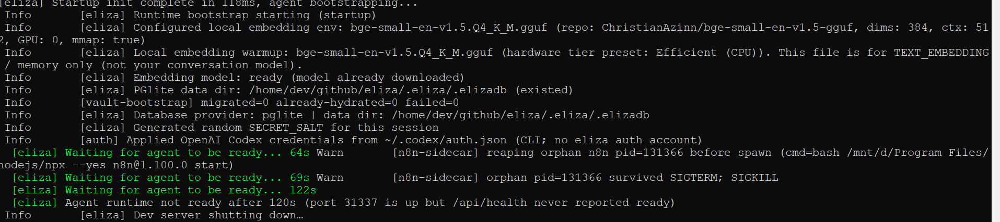

# 开发提示词

# P1
当前文档并未提到项目该如何本地编译，请你分析该项目，给出本地编译运行的方案。
如果缺少相应的程序依赖，请自行下载。
如果有必须要我配置的问题（比如key，密码等），请停下，让我配置即可。
请新增一个中文说明文档，把环境配置、编译方法、启动方法等等写到该文件中。
尽量不要动当前项目的代码，除非必须更改。
该项目的github地址在：https://github.com/elizaOS/eliza/tree/main。遇到一些问题，可以在Issue中询问查看。

# P2
不要编译源码生成组件，直接下载可用的二进制包。
哪个地方需要sudo输入密码来着，请告诉我，我来操作。

# P3
我看你上面的内容，说要使用conda的g++来编译源码，是哪个组件呢？我的意思是不要使用编译源码的方法，能直接下载二进制包就让我来下载，这个过程可能需要sudo

# P4
能增加对deepseek模型的配置吗？
当前需要配置的模型和API KEY中没有deepseek选项，请增加。
还有就是我到底怎么编译运行整个项目呢？

# P5
这个ELIZA_NO_VISION_DEPS是干什么的？设置为1会有什么后果？补充到LOCAL_DEV_ZH.md文档中。

# P6
我已经安装了fswebcam，直接运行bun run dev,
但启动不了,如图：
